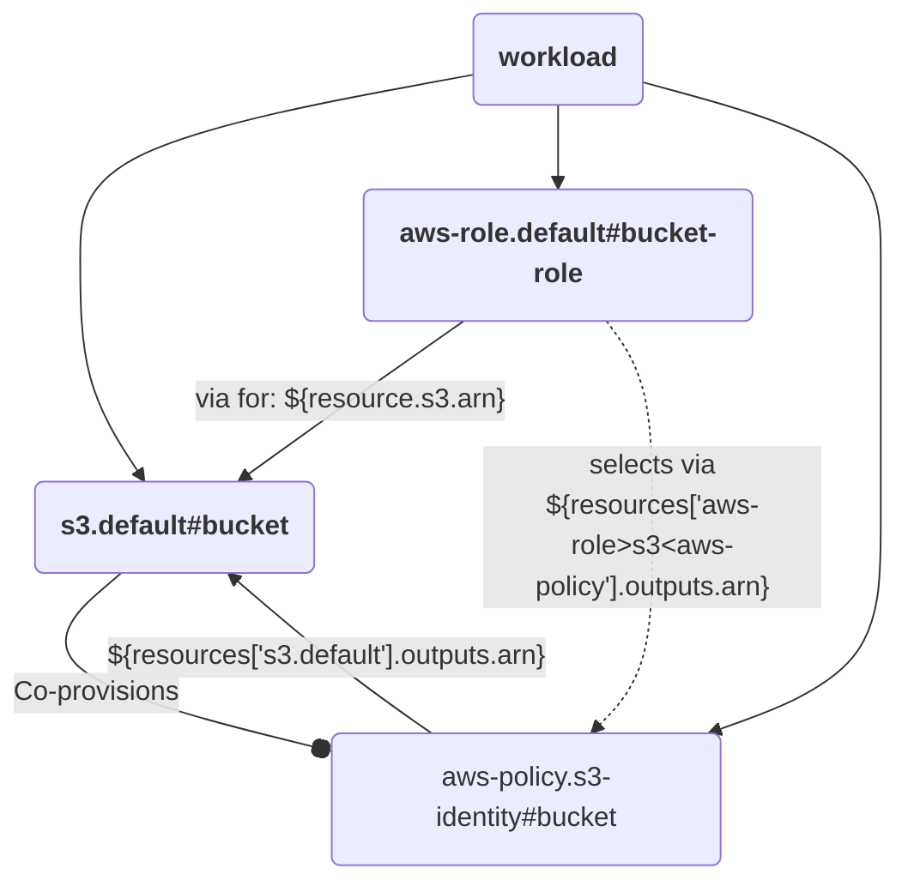

# Identity AWS Role Assumption

This example demonstrates how a role can be generated for a workload to use via Role Assumption. The developer can define what resources the role is for within the score file.

The example has 3 resource definitions:
- an `s3` resource representing the resource that the workload is trying to access
- an `aws-policy` that is co-provisioned by the `s3` and provides an Identity Based policy for the `s3` resource
- an `aws-role` that is intended to be provisioned via score. It selects all `aws-policies` attched to resources it is "for".

Here is the Resource graph that would be generated for the following resources section in a score file:

```yaml

...
resources:
  bucket:
    type: s3
  bucket-role:
    type: aws-role
    params:
      for: ${resources.bucket.arn}
```



## How it works

The `aws-role` contains the following selector:

```
aws-role>s3<aws-policy
```

This selector traverses the resource graph to select the following:
1. starts at the aws-role (itself) and
2. then finds all `s3` resources that it depends on
3. finally it find all `aws-policies` that depend on the `s3` resources it matches.

## Usecases

This pattern can be useful if accessing resources in another AWS account. Assuming a role in the other AWS account would then allow for identity policies to be used there.